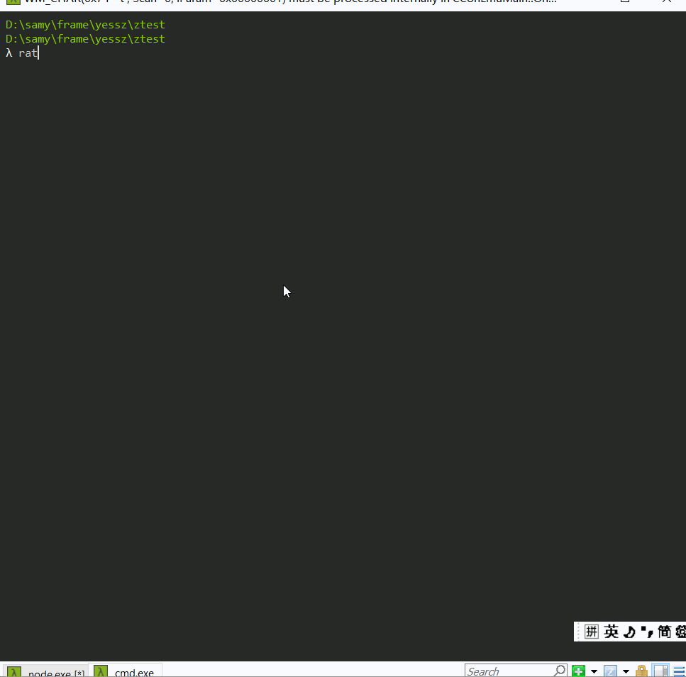
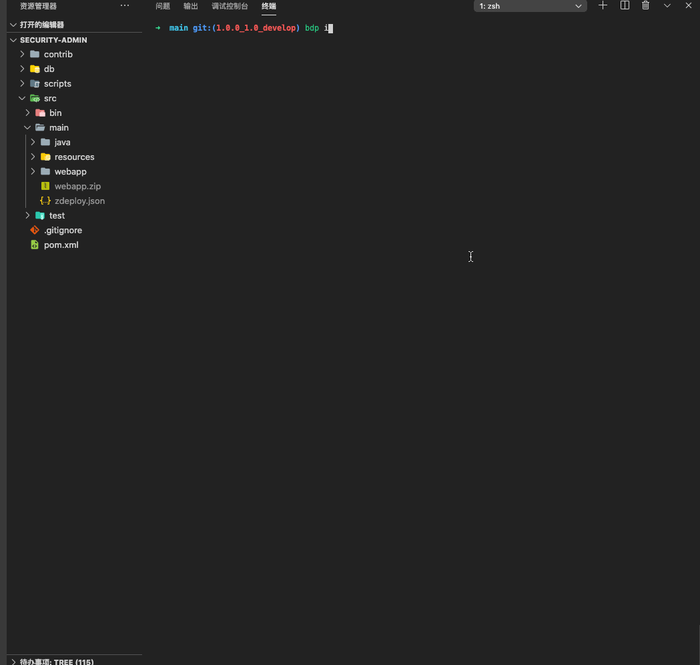

# rat-cli 

基于Github/GitLab快速创建项目/模块/页面的脚手架;

[](https://www.npmjs.org/package/rat-cli)
[](https://npmjs.org/package/rat-cli)
<!-- [](https://raw.githubusercontent.com/sakitam-fdd/rat-cli/master/LICENSE) -->
<!-- [](https://github.com/sakitam-fdd/rat-cli/stargazers) -->

简体中文 | [English](./README_en-US.md)

## 安装

```bash
npm i -g @samyzh/rat-cli
#或者
yarn global add @samyzh/rat-cli
```

## 支持

- 提供脚手架管理： 下载，初始化，版本选择等功能；

- 提供exts接口，开发者可自定义生成的项目的选项，提供生成成功后的钩子；

- 支持ejs模板编译；

- 基于所有的github/gitlab(私有token)项目组; 

  - 默认支持github组织方式；

  - 配置支持gitlab私有组；

   ```bash
  registrytpl=bdp-tpl
  registryblk=bdp-blk
  metal=true
  ### github默认配置；
  isPrivate=false
  type=orgs
  baseApi=https://api.github.com
  baseGit=https://github.com
  ### gitlab默认配置；
  isPrivate=true
  token=xxx
  baseApi=http://gitlab.xxx.com/api/v4/groups/bdp-fe%2f
  baseGit=https://gitlab.xxx.com/bdp-fe/
   ```

## 使用

```bash
rat/rat-cli init tpl/blk/deploy
rat tpl/blk config set <k> <v>
rat tpl/blk config get <k>
rat tpl/blk config remove <k>
rat tpl/blk install
rat tpl/blk uninstall
rat tpl/blk update
rat tpl/blk list
rat tpl/blk search
rat deploy
```

### 项目/模块/页面命令

> 【CRUD】

- install
- update
- list
- uninstall
- search



默认模板

## 关于exts

增加exts接口目录，其中放置 ask.js， hook.js， 方便扩展，若没有则使用内置的；

`ask.js` ：可以是数组， 可以是一个返回数组的方法；遵循 [Inquirer prompt参数](https://github.com/SBoudrias/Inquirer.js#prompt)

`hook.js` ：目前只提供生成成功后方法也就是after，提供给开发者作扩展用。after函数，可以是async function, 返回Promise实例的函数，普通函数。

内置的`ask.js` ,项目模板用的ask; 

- name
- private
- description
- author
- license
- proName

内置的`askblk.js`,模块及页面用的ask;

- proName
- moduleName
- pageName
- name

## 模板说明

### 离线路径

- 下载路径目录：
  - win环境下`C:\Users\xxx\.rat`;
  - mac环境下 `Users/xxx/.rat`;
- 模板管理说明：
  - `tpl`目录下,放项目相关模板；
  - `blk`目录下,放模块相关模板；

### 模板规则

模板项目命名规则，要按照这个规则，要不然搜索匹配不到项目；

- `*-tpl-*` 项目 ； 如: `adm-tpl-vue`
- `module-*` 模块；如: `module-base-blk`
- `page-*` 页面；如: `page-table-cate`

### 默认模板

#### `bdp-tpl`

> 项目技术栈模板；

| 类型            | 技术栈                            | 描述 | 备注 |
| --------------- | --------------------------------- | ---- | ---- |
| `adm-tpl-react` | `react`, `antd-4.x`,`antd-pro5.x` | 管理 |      |
| `adm-tpl-vue`   | `vue`,`antd-vue`                  | 管理 |      |
| `mod-tpl-vue`   | `vue`, `vant`                     | h5   |      |

#### `bdp-blk`

> 目前基于上云`bdp-tpl-sub `的业务组件，通过脚手架快速创建；

| 类型                | 技术栈  | 归属项目       | 描述             | 备注 |
| ------------------- | ------- | -------------- | ---------------- | ---- |
| `module-base-blk`   | `react` | `bdp-tpl-sub ` | 基模块           |      |
| `page-base-blk`     | `react` | `bdp-tpl-sub ` | 基本页面         |      |
| `page-table-cate`   | `react` | `bdp-tpl-sub ` | 列表组件         |      |
| `page-table-card`   | `react` | `bdp-tpl-sub ` | 列表卡片切换组件 |      |
| `page-card-cate`    | `react` | `bdp-tpl-sub ` | 卡片组件         |      |
| `page-rowcard-list` | `react` | `bdp-tpl-sub ` | 卡片列表组件     |      |
| `page-form`         | `react` | `bdp-tpl-sub ` | 表单组件         |      |
| `page-steps `       | `react` | `bdp-tpl-sub ` | 步骤组件         |      |

## 配置模板，支持上传或者下载功能；
运行 `bdp init deploy`, 生产部署配置后，再修改相关配置，后再运行`bdp deploy` 部署；

`zdeploy.json`
```json
[
  {
    "type": "upload",
    "name": "开发环境",
    "host": "127.0.0.1",
    "port": "22",
    "username": "",
    "password": "",
    "localCmd": "npm run build && zip -r dist.zip dist/",
    "serverCmd": "cd /home/deploy/fe-deploy/ && mv dist/ dist-bak/",
    "localScp": "dist.zip",
    "serverScp": "/home/deploy/fe-deploy/dist.zip",
    "serverHookCmd": "cd /home/deploy/fe-deploy/ && unzip dist.zip",
    "localHookCmd": ""
  },
  {
    "type": "download",
    "name": "生产环境",
    "host": "127.0.0.2",
    "port": "2222",
    "username": "deploy",
    "password": "xxx",
    "localCmd": "zip -r dist.zip dist/ && mv dist.zip dist-bak.zip",
    "serverCmd": "cd /home/deploy/fe-deploy/ && zip -r dist.zip dist/",
    "localScp": "./",
    "serverScp": "/home/deploy/fe-deploy/dist.zip",
    "serverHookCmd": "",
    "localHookCmd": "unzip dist.zip"
  }
]

```
演示



## TODO

- [x] 支持模板的下载，卸载，查看；
- [x] 支持初始化，项目模板及子模块模板管理；
- [x] 支持内置一键上传部署和下载资源功能；
- [ ] 一键添加子系统相关脚本；


## 更新日志

[详见](./CHANGELOG.md)

